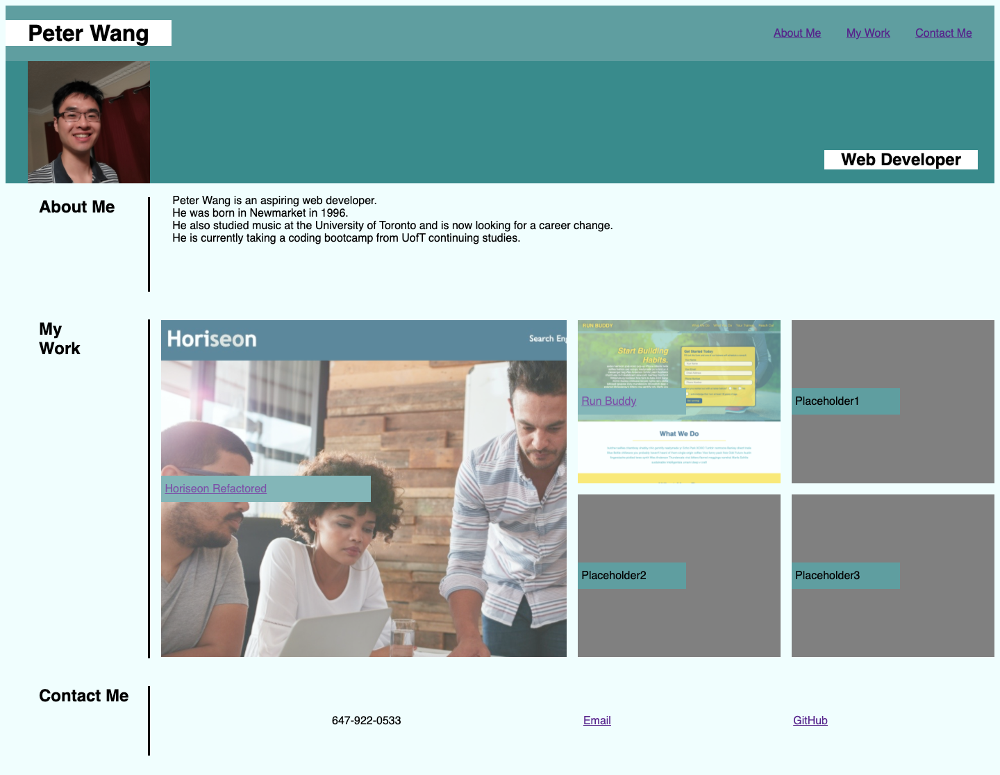

## Description
My portfolio, showcasing information about myself, my projects, and my contact info.
## Challenges
I couldn't for the life of me figure out how to use media queries properly.
Maybe this was because the CSS wasn't written in the most efficient way, but I don't have time to rewrite it at this point.
I tried to find a compromise, so I ended up using the media queries to resize the whole page instead.
## Deployed application:
https://peterw712.github.io/portfolio/
## Screenshot

=======
## Description
My portfolio, showcasing information about myself, my projects, and my contact info.
## Challenges
I couldn't for the life of me figure out how to use media queries properly.
Maybe this was because the CSS wasn't written in the most efficient way, but I don't have time to rewrite it at this point.
I tried to find a compromise, so I ended up using the media queries to resize the whole page instead.
## Deployed application:
https://peterw712.github.io/portfolio/
## Screenshot:

>>>>>>> 21a503a3984a319881699cd88796ee03c87592e7
